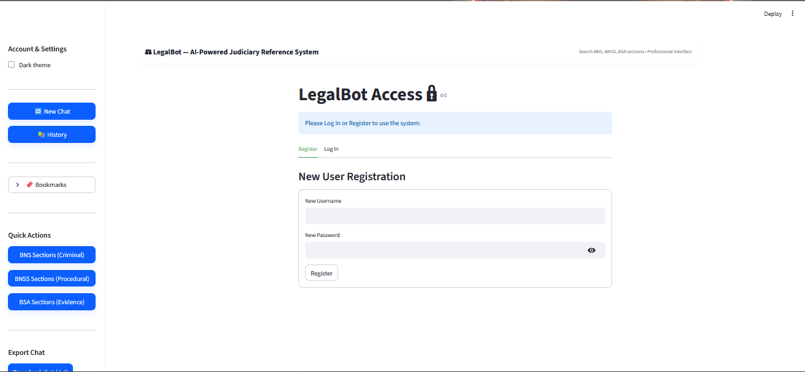
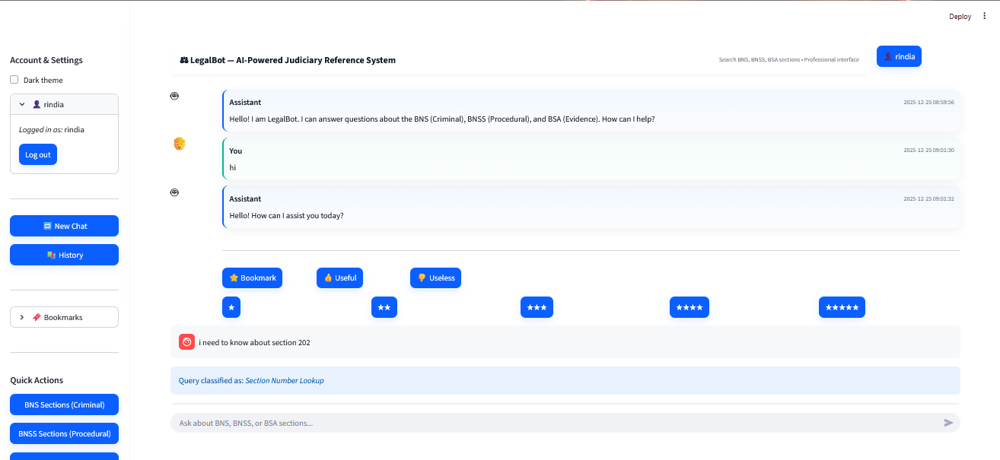

# AI-Based-Legal-Reference-and-Case-Retrieval-System_October_Batch-4_2025
# ⚖️ LegalBot: AI-Powered Judiciary Reference System


> **Democratizing access to Indian Law.** > An advanced RAG-based AI assistant that simplifies the **Bharatiya Nyaya Sanhita (BNS)**, **Bharatiya Nagarik Suraksha Sanhita (BNSS)**, and **Bharatiya Sakshya Adhiniyam (BSA)** for citizens and legal professionals.

---

## 📖 Overview

**LegalBot** addresses the complexity of navigating India's new criminal legal codes. Instead of manually searching through thousands of pages of PDF documents, users can ask natural language questions.

The system uses **Retrieval-Augmented Generation (RAG)** to fetch the exact legal sections and uses **Google Gemini Pro** to summarize them into simple, hallucination-free explanations.

---

## 🚀 Key Features

* **🧠 Smart Legal Retrieval:** Instantly finds precise sections (e.g., "Section 103") based on user intent, not just keywords.
* **🤖 AI-Powered Summaries:** Converts complex legal jargon into plain English using Google Gemini Pro.
* **📚 RAG Architecture:** Strictly grounds all answers in the uploaded PDF documents to ensure **100% accuracy**.
* **📂 Multi-Law Support:** seamless switching between Criminal (BNS), Procedural (BNSS), and Evidence (BSA) laws.
* **💾 Session Memory:** Remembers chat history and allows users to bookmark important legal sections.
* **🔐 User Authentication:** Secure login and registration system.

---

## 📸 Screenshots

| **Home Dashboard** | **Smart RAG Retrieval** |
|:---:|:---:|
|  |  |
| *Intuitive Streamlit Interface* | *AI citing exact legal sources* |

---

## 🛠️ Tech Stack

| Component | Technology Used |
| :--- | :--- |
| **Frontend** | Streamlit (Python Framework) |
| **LLM / AI** | Google Gemini Pro API |
| **Data Processing** | PyPDF2, Regex (Custom Extraction Scripts) |
| **NLP Pipeline** | SpaCy, NLTK, TF-IDF Vectorization |
| **Machine Learning** | Scikit-Learn (Logistic Regression for Query Classification) |
| **Version Control** | Git & GitHub |

---

## ⚙️ Installation & Setup

Follow these steps to run LegalBot on your local machine:

**1. Clone the Repository**
```bash
git clone [https://github.com/Rishwanth11/LegalBot-AI-System.git](https://github.com/Rishwanth11/LegalBot-AI-System.git)
cd LegalBot-AI-System
# AI-Based-Legal-Reference-and-Case-Retrieval-System_October_Batch-4_2025
# github commmit
